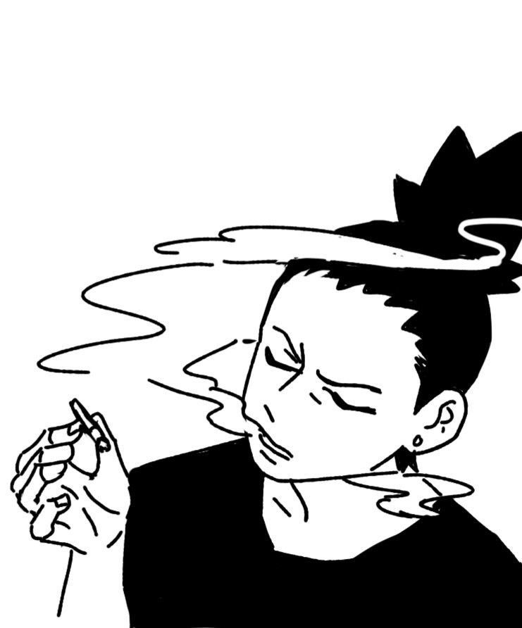
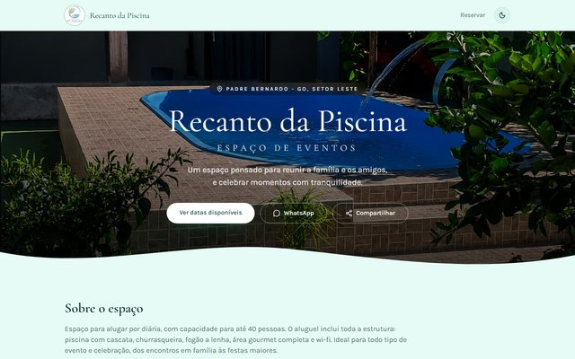
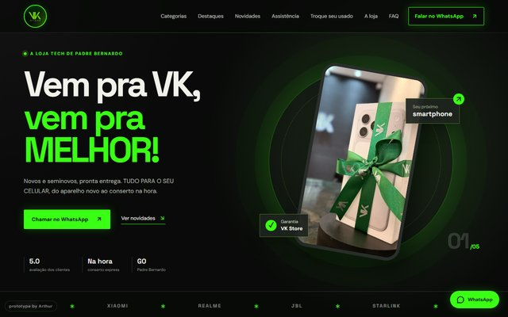
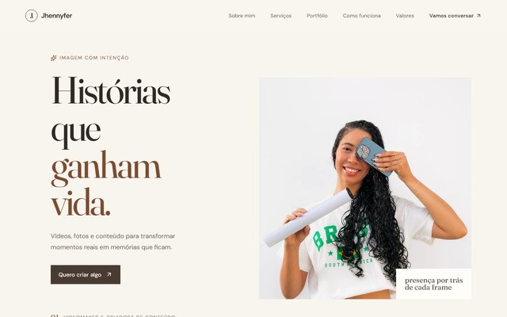

 

  

<!-- ============ SOBRE MIM ============ -->

 

Oi! Sou o **Arthur**, estudante de **Engenharia de Software** na Universidade Católica de Brasília.

Crio **sites e sistemas web para negócios locais**, do layout ao deploy: páginas rápidas, fáceis de usar e com o cliente conseguindo atualizar o próprio conteúdo.

  

<!--  -->

<!-- Se tiver LinkedIn, descomente e troque o link: -->
<!--  -->

 
 

<!-- ============ ARSENAL ============ -->

**Front-end**

**Back-end & Deploy**

  

<!-- ============ PROJETOS ============ -->

<table>
<tr>
<td width="50%" valign="top">

 <b>Recanto da Piscina</b> · ENTREGUE 
Sistema de reservas com domínio próprio: calendário em tempo real, painel admin, aprovação por e-mail e galeria gerenciável pelo cliente. 
<a href="https://www.recantodapiscina.com.br">Ver site →</a> · <a href="https://github.com/Sunnyzit0/recanto-booking-bliss">Código →</a>
</td>
<td width="50%" valign="top">

 <b>Jaquefisio</b> · React + Tailwind 
Site para fisioterapeuta, com foco em acessibilidade para pacientes idosos e páginas próprias para cada serviço. 
<a href="https://jaquefisio.vercel.app">Ver site →</a> · <a href="https://github.com/Sunnyzit0/jaquefisio">Código →</a>
</td>
</tr>
<tr>
<td width="50%" valign="top">

 <b>VK Store</b> · Loja + assistência 
Site para loja de celulares e assistência técnica, com contato direto pelo WhatsApp. 
<a href="https://vk-store-two.vercel.app">Ver site →</a> · <a href="https://github.com/Sunnyzit0/vk-store">Código →</a>
</td>
<td width="50%" valign="top">

 <b>Jhennyfer Videomaker</b> · EM DESENVOLVIMENTO 
Portfólio para videomaker, feito com Vite + React. 
<a href="https://jhennyfer-videomaker.vercel.app">Ver site →</a> · <a href="https://github.com/Sunnyzit0/jhennyfer-videomaker">Código →</a>
</td>
</tr>
</table>

 

